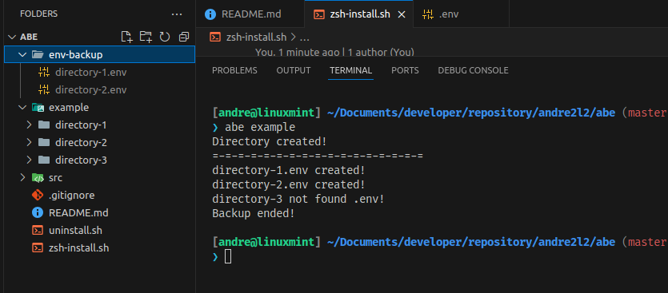

# Abe - Automatic backup environments

<div align="center">
  
</div>

## ZSH Install

```bash
curl https://raw.githubusercontent.com/andre2l2/abe/master/zsh-install.sh | sh
```

## Unistall

```bash
curl https://raw.githubusercontent.com/andre2l2/abe/master/uninstall.sh | sh
```
